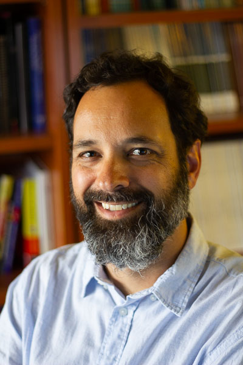

# People
-------------------------

## Current Members

 

### Moin Syed, Ph.D. - Director

Moin Syed is a McKnight Presidential Endowed Professor of Psychology at the 
University of Minnesota, Twin Cities. His research focuses on identity and 
personality development among ethnically and culturally-diverse adolescents 
and emerging adults. Dr. Syed has conducted numerous workshops on methods, 
open science, preregistration, and theory development across the U.S. and Europe, 
and has edited multiple special issues of journals focusing on Registered Reports, 
a new publication format that prioritizes study conceptualization and design 
over findings in order to combat publication bias. He is currently the Editor
of Infant and Child Development, is co-Editor (with Kate C. McLean)
of the Oxford Handbook of Identity Development, the past Editor of Emerging 
Adulthood, the official journal of the Society for the Study of Emerging Adulthood, 
and is past President of the International Society for Research on Identity. 

[Google Scholar](https://scholar.google.com/citations?user=mshMvCwAAAAJ&hl=en) | 
[OSF](https://osf.io/b3tx8/)  | 
[GitHub](https://github.com/syeducation) |
[Bluesky](https://bsky.app/profile/syeducation.bsky.social) | 
[Blog](https://getsyeducated.substack.com/) 

## Current Affiliated Members

### Caroline Armstrong, Ph.D. student, Social Psychology Program

### Trinity Barnes, Ph.D. student, Institute of Child Development

### Emily Chan, Ph.D. student, Social Psychology Program

### Edward Chou, Ph.D. student, Personality, Individual Differences, and Behavior Genetics Program

### Abby Person, Ph.D. student, Social Psychology Program

Moin Syed also co-supervises doctoral students at other institutions, 
particularly at the University of Gothenburg, Sweden

### Tommy Reinholdsson, Department of Psychology, University of Gothenburg, Sweden

## Past Members - Advisees

### Rudy Perez, M.A. (2025)

### Linh Nguyen, Ph.D. (2024)

### Dulce Wilkinson Westberg, Ph.D. (Post-Doc, 2022-24)

### Aisha Udochi, M.A. (2022)

### Ummul-Kiram Kathawalla, Ph.D. (2021)

### Jillian Fish, Ph.D. (2020)

### Shogo Hihara, Ph.D. (Post-Doc, 2019-20)

### Sarah (Morrison-Cohen) Nelson, Ph.D. (2019) 

### Alex Ajayi, Ph.D. (2018)

### Lauren Mitchell, Ph.D. (2018)

### Lovey (Walker) Peissig, Ph.D. (2016) 

### Hasan Atak, Ph.D. (Post-Doc, 2015-16)

### Mary Joyce Juan, Ph.D. (2014)

### Reiko Hirai, Ph.D. (2013)

## Past Members - Affiliated

### Py Liv Eriksson, Ph.D. 

### José Causadias, Ph.D. (2014)

### Adam Kim, Ph.D. 

### Sheila Frankfurt, Ph.D. 

### Johanna Carlsson, Ph.D. 

### Fanny Gyberg, Ph.D. 

### Ursula Moffitt, Ph.D. 

### Alison Hu, Ph.D. 

### Joyce Lee, Ph.D. 

### Xiang Zhou, Ph.D. 

### AnnaMarie Vu, Ph.D. 

### Nazneen Bahrassa, Ph.D. 

### Reid Reichwald, Ph.D. 

### Oh Myo Kim, Ph.D. 
